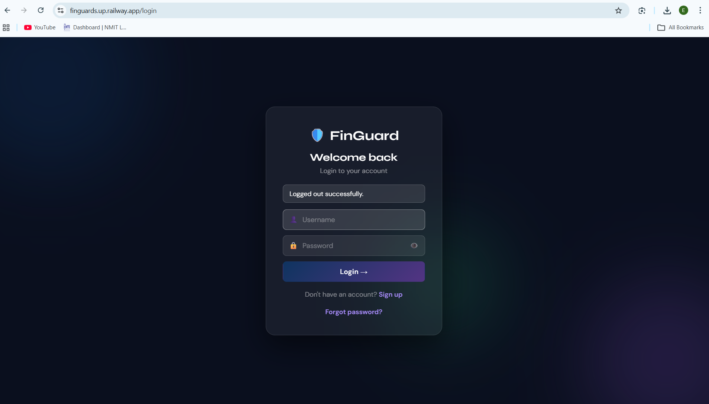
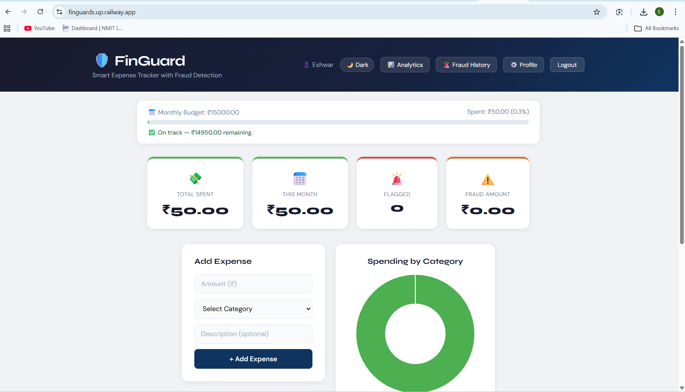
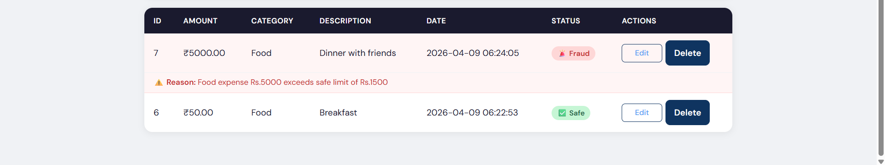
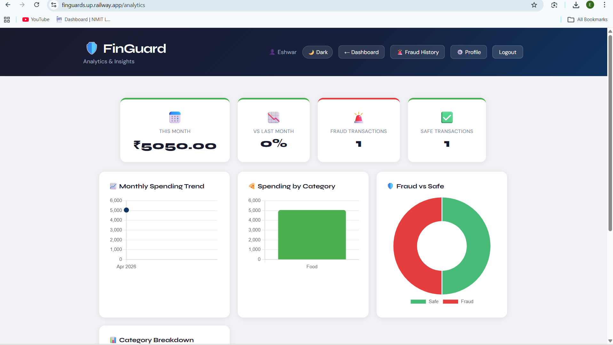
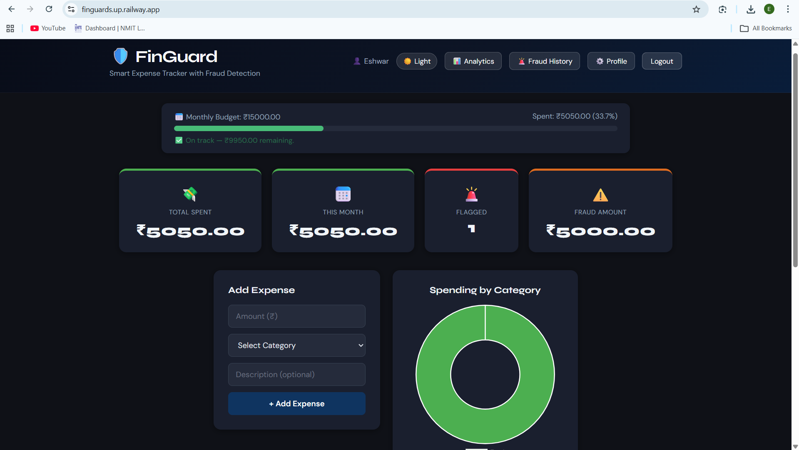
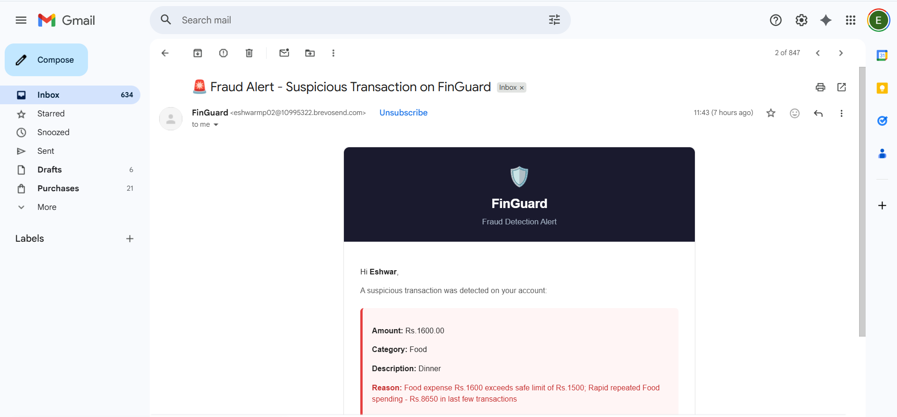

# 🛡️ FinGuard — Smart Expense Tracker with Fraud Detection

[](https://finguard-1tp7.onrender.com)
[](https://python.org)
[](https://flask.palletsprojects.com)
[](https://mysql.com)
[](https://render.com)

> A full-stack web application for tracking personal expenses with real-time rule-based fraud detection and instant email alerts via Brevo.

---

## 🌐 Live Demo

**[https://finguard-1tp7.onrender.com](https://finguard-1tp7.onrender.com)**

> Note: First load may take 30-60 seconds as the free tier spins up from sleep.

---

## 📸 Screenshots

| Login Page | Dashboard |
|-----------|-----------|
|  |  |

| Fraud Detection | Analytics |
|----------------|-----------|
|  |  |

| Dark Mode | Email Alert |
|-----------|-------------|
|  |  |

---

## ✨ Features

### 💰 Expense Management
- Add, edit, and delete transactions
- 6 spending categories: Food, Travel, Bills, Shopping, Entertainment, Others
- Search by description, filter by category, date range, and fraud status
- Export transactions to Excel-compatible CSV

### 🚨 Fraud Detection (Rule-Based System)
Automatically flags suspicious transactions based on 5 rules:

| Rule | Description |
|------|-------------|
| Category threshold | Each category has a safe spending limit (e.g. Food > ₹1,500) |
| Personal average | Flags if amount is 3x above your own average for that category |
| High-value transaction | Warns for transactions above ₹10,000, alerts above ₹15,000 |
| Rapid spending | Detects repeated spending in the same category within a short time |
| Round number anomaly | Flags suspiciously round large amounts as potential fake entries |

### 📧 Email Notifications (via Brevo)
- **Welcome email** on account creation
- **Instant fraud alert** when a suspicious transaction is detected — delivered directly to inbox
- **Password reset** via secure token link (expires in 1 hour)

### 📊 Analytics Dashboard
- Monthly spending trend (line chart — last 6 months)
- Category-wise bar chart
- Fraud vs Safe transaction ratio (doughnut chart)
- Category breakdown table with average per transaction
- Month-over-month spending comparison card

### 👤 User Management
- Secure signup/login with **bcrypt password hashing**
- Session-based authentication with @login_required decorator
- Profile management — update username, email, change password
- Monthly budget with progress bar (green → orange → red as limit approaches)
- Forgot password / reset password flow with email verification

### 🎨 UI/UX
- Light/Dark mode toggle (preference saved via localStorage)
- Glassmorphism login/signup pages with animated blob background
- Fully mobile responsive layout
- Real-time fraud badge + reason shown inline in transaction table

---

## 🛠️ Tech Stack

| Layer | Technology |
|-------|-----------|
| Frontend | HTML, CSS, Jinja2, Chart.js |
| Backend | Python, Flask |
| Database | MySQL (Filess.io) |
| Authentication | bcrypt, Flask sessions |
| Email | Brevo HTTP API |
| Deployment | Render |
| Version Control | GitHub |

---

## 📁 Project Structure

```
EXPENSE_TRACKER/
├── app.py                  # All backend routes and logic
├── requirements.txt        # Python dependencies
├── Procfile                # Render deployment config
├── screenshots/            # Project screenshots
├── static/
│   └── style.css           # All styling + dark mode
└── templates/
    ├── index.html          # Dashboard
    ├── analytics.html      # Analytics page
    ├── login.html          # Login
    ├── signup.html         # Signup
    ├── edit.html           # Edit transaction
    ├── fraud.html          # Fraud history
    ├── profile.html        # User profile
    ├── forgot.html         # Forgot password
    └── reset.html          # Reset password
```

---

## 🚀 Local Setup

### Prerequisites
- Python 3.10+
- MySQL 8.0
- Git

### Steps

**1. Clone the repository**
```bash
git clone https://github.com/Eshwarmp/finguard.git
cd finguard
```

**2. Install dependencies**
```bash
pip install -r requirements.txt
```

**3. Set up MySQL database**
```sql
CREATE DATABASE expense_tracker;
USE expense_tracker;
-- Run setup.sql, then alter.sql, then alter2.sql, then alter3.sql
```

**4. Create .env file**
```env
SECRET_KEY=your_secret_key
DB_HOST=localhost
DB_USER=root
DB_PASSWORD=your_mysql_password
DB_NAME=expense_tracker
DB_PORT=3306
MAIL_USER=your_gmail@gmail.com
BREVO_API_KEY=your_brevo_api_key
```

**5. Run the app**
```bash
# Windows
run.bat

# Mac/Linux
python app.py
```

**6. Open in browser**
```
http://localhost:5000
```

---

## 🔐 Security Features
- Passwords hashed with **bcrypt** — never stored in plain text
- All secrets stored as environment variables — never hardcoded
- @login_required decorator protects all authenticated routes
- Delete/edit operations verify user_id to prevent unauthorized access
- Password reset tokens expire after 1 hour
- CSRF protection via Flask session secret key

---

## 📧 Email Setup (Brevo)

This project uses [Brevo](https://brevo.com) for transactional emails instead of SMTP, which works reliably on cloud deployments like Render where SMTP ports are often blocked.

To configure:
1. Sign up at **brevo.com** (free — 300 emails/day)
2. Go to **Settings → Senders, domains, IPs** → verify your sender email
3. Go to **Transactional → Email → API Keys** → generate a key
4. Go to **Settings → Security → Authorized IPs** → deactivate IP blocking for API keys
5. Add `BREVO_API_KEY` and `MAIL_USER` to your environment variables

---

## 🌐 Deployment (Render + Filess.io)

This app is deployed on [Render](https://render.com) with a [Filess.io](https://filess.io) MySQL database — both free forever with no expiry.

Environment variables required on Render:

```
SECRET_KEY
DB_HOST               (from Filess.io connection details)
DB_USER               (from Filess.io connection details)
DB_PASSWORD           (from Filess.io connection details)
DB_NAME               (from Filess.io connection details)
DB_PORT               (from Filess.io connection details)
MAIL_USER             (your verified Brevo sender email)
BREVO_API_KEY         (from Brevo API keys)
RENDER_EXTERNAL_URL   https://finguard-1tp7.onrender.com
```

---

## 👨‍💻 Author

**Eshwar M P**
- Department of Information Science & Engineering, NMIT Bengaluru
- GitHub: [@Eshwarmp](https://github.com/Eshwarmp)
- Live Project: [finguard-1tp7.onrender.com](https://finguard-1tp7.onrender.com)

---

## 📄 License

This project is open source and available under the [MIT License](LICENSE).